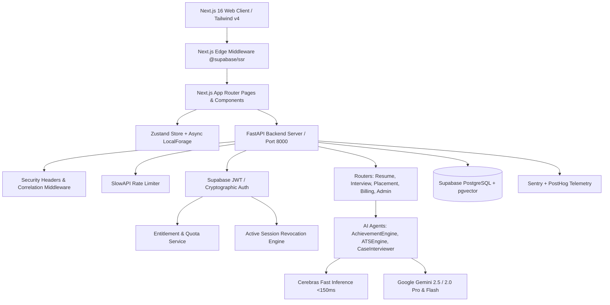

# InternPrep AI — Platform Improvement & Engineering Transformation Plan

> **Comprehensive Audit, Architectural Remediation, and Phase-Wise Implementation Roadmap**  
> *Compiled from full-stack audits across Frontend, Backend, AI Engines, Security, UX, and Observability.*

---

## Executive Summary

This document consolidates all findings from the multi-phase codebase audits conducted on the **InternPrep AI** platform. It outlines a structured, **phase-wise engineering roadmap** categorized by severity (P0 Critical $\to$ P3 Polish & Scale) to elevate the platform from a working prototype into a robust, high-performance, enterprise-ready placement intelligence system.

---

## Table of Contents

1. [Architecture & System Health Overview](#1-architecture--system-health-overview)
2. [Categorized Audit Findings & Problem Statements](#2-categorized-audit-findings--problem-statements)
   - [A. Frontend Architecture & Next.js App Router](#a-frontend-architecture--nextjs-app-router)
   - [B. State Management, Hydration & Type Rigor](#b-state-management-hydration--type-rigor)
   - [C. Edge Security, Authentication & Session Revocation](#c-edge-security-authentication--session-revocation)
   - [D. Backend API Reliability, Rate Limiting & Error Envelopes](#d-backend-api-reliability-rate-limiting--error-envelopes)
   - [E. AI Engine Performance, Streaming & Schema Resilience](#e-ai-engine-performance-streaming--schema-resilience)
   - [F. UI/UX, Design Systems, Accessibility & Micro-Interactions](#f-uiux-design-systems-accessibility--micro-interactions)
   - [G. Observability, Analytics & Test Automation](#g-observability-analytics--test-automation)
3. [Phase-Wise Implementation Roadmap](#3-phase-wise-implementation-roadmap)
   - [Phase 1: Critical Framework Boundaries & Edge Auth Security (P0)](#phase-1-critical-framework-boundaries--edge-auth-security-p0)
   - [Phase 2: Monolithic Page Decomposition & Codebase Modularization (P1)](#phase-2-monolithic-page-decomposition--codebase-modularization-p1)
   - [Phase 3: Real-Time SSE Streaming & Backend AI Resilience (P1)](#phase-3-real-time-sse-streaming--backend-ai-resilience-p1)
   - [Phase 4: Design System Polish, Accessibility & Rich Empty/Skeleton States (P2)](#phase-4-design-system-polish-accessibility--rich-emptyskeleton-states-p2)
   - [Phase 5: Automated Testing, Telemetry & Quality Assurance (P2)](#phase-5-automated-testing-telemetry--quality-assurance-p2)
   - [Phase 6: Advanced Voice Engine & Domain Expansions (P3)](#phase-6-advanced-voice-engine--domain-expansions-p3)
4. [Decision Points & Input Clarifications](#4-decision-points--input-clarifications)
5. [Verification & Acceptance Criteria](#5-verification--acceptance-criteria)

---

## 1. Architecture & System Health Overview



---

## 2. Categorized Audit Findings & Problem Statements

### A. Frontend Architecture & Next.js App Router
| Severity | Finding | Root Cause | Impact |
| :--- | :--- | :--- | :--- |
| **P0 (Critical)** | Missing Error Boundaries (`error.tsx`, `global-error.tsx`) | No root or route-level error boundaries defined. | Any unhandled client exception causes a white/unrendered crash screen rather than a branded recovery UI. |
| **P0 (Critical)** | Missing Route Skeletons (`loading.tsx`) | No streaming loading boundaries for App Router pages. | Page transitions to heavy views feel unresponsive with no immediate visual feedback. |
| **P1 (High)** | Missing Search Engine & Link Infrastructure | No `sitemap.ts`, `robots.ts`, or `metadataBase` in root layout. | Sub-optimal SEO indexing and build-time metadata warnings. |
| **P1 (High)** | Monolithic Page Files (2,000–3,850+ lines) | Large feature sets accumulated inside single `page.tsx` files. | Slow IDE performance, high risk of regression, slow hot reload, and impossible unit test isolation. |
| **P2 (Medium)** | Missing Custom 404 Page (`not-found.tsx`) | Default Next.js 404 page is rendered for invalid paths. | Breaks user immersion; missing navigation back to dashboard/landing. |

---

### B. State Management, Hydration & Type Rigor
| Severity | Finding | Root Cause | Impact |
| :--- | :--- | :--- | :--- |
| **P0 (Critical)** | Async Storage Hydration Flash | `auth-store.ts` utilizes `localforage` (async storage) without tracking an `_hasHydrated` flag. | Components rendering immediately on mount read default state (`user: null`), causing a brief flash of logged-out/guest UI before storage hydrates. |
| **P1 (High)** | Pervasive `any` Types in State & APIs | `user: any`, `resumes: any[]`, `feedback: any`, `quantified_metrics: any` in stores. | Lack of compile-time safety leads to potential runtime `TypeError: cannot read properties of undefined`. |
| **P2 (Medium)** | Uncentralized Toast Feedback | Pages mix raw `alert()`, inline error text, and custom banners. | Inconsistent feedback experience when operations fail or succeed. |

---

### C. Edge Security, Authentication & Session Revocation
| Severity | Finding | Root Cause | Impact |
| :--- | :--- | :--- | :--- |
| **P0 (Critical)** | Client-Only Route Gating | Route protection for `/dashboard`, `/billing`, `/admin` is evaluated inside client-side `useEffect`. | Unauthorized users see a flash of protected page layouts before being redirected. |
| **P1 (High)** | Token Refresh Drift | Tokens refreshed on the client do not synchronously update Edge server cookies. | Occasional 401s on long sessions when switching tabs. |

---

### D. Backend API Reliability, Rate Limiting & Error Envelopes
| Severity | Finding | Root Cause | Impact |
| :--- | :--- | :--- | :--- |
| **P1 (High)** | Bare `except Exception:` Blocks | Multiple catch-all exception blocks in `usage_service.py`, `entitlement_service.py`, and `gemini_client.py`. | Errors are swallowed silently or return generic 500s without structured error codes. |
| **P1 (High)** | Monolithic Agent & Router Files | `achievement_engine.py` (97 KB), `ats_engine.py` (70 KB), `placement_analysis.py` (55 KB). | High cognitive load for maintenance; prompt updates risk breaking parsing logic. |
| **P2 (Medium)** | Synchronous Heavy AI Processing | Resume ATS analysis, batch bullet refinement, and recruiter rubric generation run synchronously (15–25s HTTP requests). | High risk of reverse-proxy / gateway timeout (504) on slow connections. |

---

### E. AI Engine Performance, Streaming & Schema Resilience
| Severity | Finding | Root Cause | Impact |
| :--- | :--- | :--- | :--- |
| **P1 (High)** | Client-Side Timeout Polling in Feedback | `feedback/page.tsx` uses a 6-second `setTimeout` retry hack if recruiter feedback is not yet compiled. | Fragile user experience; feels broken if generation takes > 12 seconds. |
| **P2 (Medium)** | Single-Tier Web Speech API in Mock Interviews | Relies solely on browser `webkitSpeechRecognition` / `speechSynthesis`. | Inconsistent speech recognition on iOS Safari / Firefox; robotic voices; struggles with niche financial/consulting terms. |
| **P2 (Medium)** | LLM Output Parsing Vulnerability | Complex JSON schemas from Cerebras/Gemini occasionally wrap in markdown fences or omit optional keys. | Occasional parse failures requiring manual retries. |

---

### F. UI/UX, Design Systems, Accessibility & Micro-Interactions
| Severity | Finding | Root Cause | Impact |
| :--- | :--- | :--- | :--- |
| **P1 (High)** | Spinner-Heavy Loading States | `<Loader2 className="animate-spin" />` used everywhere instead of layout-matching skeleton cards. | Visually jarring layout shifts (CLS) when data arrives. |
| **P2 (Medium)** | Accessibility (a11y) & Keyboard Navigation | Tabs, filter buttons, and dialogs lack explicit ARIA roles (`role="tablist"`, `aria-selected`, `aria-expanded`). | Poor screen-reader usability and non-standard keyboard tab navigation. |
| **P2 (Medium)** | Plain Empty States | 0-item states in `/history`, `/dashboard`, and `/creator-dashboard` show bare empty space. | Missed opportunity to onboard candidates into their first practice session. |

---

### G. Observability, Analytics & Test Automation
| Severity | Finding | Root Cause | Impact |
| :--- | :--- | :--- | :--- |
| **P1 (High)** | Zero Automated Frontend & E2E Tests | `npm test` script is not configured; Playwright is in `devDependencies` without smoke test suites. | Regression risks when modifying shared components or auth stores. |
| **P2 (Medium)** | Uninstrumented User Funnels | PostHog is loaded, but granular milestone events (`interview_turn_completed`, `bullet_refined`, `paywall_impression`) are not uniformly tracked. | Blind spots in conversion rates and feature engagement. |

---

## 3. Phase-Wise Implementation Roadmap

```
┌──────────────────────────────────────────────────────────────────────────────────────────────────┐
│                               PHASED IMPLEMENTATION TIMELINE                                     │
├──────────────────────────────────────────────────────────────────────────────────────────────────┤
│ Phase 1 [P0 Critical]  ──► Core Framework Boundaries, Edge Auth & Hydration Safety (Immediate)    │
│ Phase 2 [P1 High]      ──► Monolithic Page Decomposition & Component Modularization              │
│ Phase 3 [P1 High]      ──► Real-Time SSE Streaming, Async Tasks & Backend Resilience              │
│ Phase 4 [P2 Medium]    ──► Design System Polish, Accessibility & Rich Skeletons/Empty States     │
│ Phase 5 [P2 Medium]    ──► Automated E2E Testing, Unit Tests & PostHog Telemetry                 │
│ Phase 6 [P3 Future]    ──► Advanced Voice Engine, High-Res PDF Reports & Domain Expansion        │
└──────────────────────────────────────────────────────────────────────────────────────────────────┘
```

---

### Phase 1: Critical Framework Boundaries & Edge Auth Security (P0)

*Goal: Harden the web application foundation, eliminate crashes, secure protected routes at the edge, and ensure 100% hydration safety.*

#### 1.1 Next.js App Router Error & Loading Boundaries
- **Create `apps/web/src/app/error.tsx`**:
  - Global client error boundary catching rendering errors.
  - Displays a branded Obsidian card with error correlation ID, user-friendly explanation, and `Reset / Try Again` and `Go to Dashboard` buttons.
- **Create `apps/web/src/app/global-error.tsx`**: Root error boundary for layout-level crashes.
- **Create `apps/web/src/app/loading.tsx`**: Universal streaming skeleton displayed during route transitions.
- **Create `apps/web/src/app/not-found.tsx`**: Branded 404 page with navigation shortcuts.

#### 1.2 Edge Route Protection Middleware
- **Create `apps/web/src/middleware.ts`**:
  - Integrates `@supabase/ssr` `createServerClient`.
  - Enforces server-side redirection for protected routes (`/dashboard`, `/billing`, `/admin`, `/creator-dashboard`, `/interview`, `/resume-builder`, `/ats-checker`).
  - Allows public guest access to `/`, `/login`, `/auth/callback`, and public demo routes.
  - Automatically updates session cookies in request/response headers.

#### 1.3 State Hydration Safety in `auth-store.ts`
- Update `apps/web/src/stores/auth-store.ts`:
  - Add `_hasHydrated: boolean` property to `AuthState`.
  - Attach `onRehydrateStorage: () => (state) => { state?.setHasHydrated(true); }`.
  - Expose a `useAuthHydrated()` hook so client components can gracefully await hydration without layout flashing.

#### 1.4 SEO & Metadata Infrastructure
- **Create `apps/web/src/app/sitemap.ts`**: Generates dynamic XML sitemap for all public URLs.
- **Create `apps/web/src/app/robots.ts`**: Specifies crawler rules and sitemap location.
- **Update `apps/web/src/app/layout.tsx`**: Set `metadataBase: new URL(process.env.NEXT_PUBLIC_APP_URL || 'https://internprep.ai')`.

---

### Phase 2: Monolithic Page Decomposition & Codebase Modularization (P1)

*Goal: Break down the 4 massive page files into clean, reusable, testable sub-components with decoupled state and presentation.*

#### 2.1 Refactor `placement-analysis/page.tsx` (3,855 lines $\to$ ~350 lines)
Decompose into `apps/web/src/components/placement-analysis/`:
1. `placement-hero-metrics.tsx`: Macro placement stats and Tier 1 distribution cards.
2. `placement-filter-bar.tsx`: Swipeable multi-domain, phase, tier, and sort toolbar.
3. `placement-table-view.tsx`: Responsive table view with horizontal swipe hint.
4. `placement-grid-view.tsx`: Company card grid with salary, stipend, and tier badges.
5. `placement-comparison-dock.tsx`: Floating comparison drawer with multi-company delta.
6. `placement-company-modal.tsx`: In-depth company interview intelligence dialog.
7. `placement-crm-drawer.tsx`: Candidate personal bookmarking and application tracker.

#### 2.2 Refactor `resume-builder/page.tsx` (3,680 lines $\to$ ~300 lines)
Decompose into `apps/web/src/components/resume-builder/`:
1. `achievement-section-card.tsx`: Individual experience/project block renderer.
2. `achievement-bullet-editor.tsx`: Live bullet editor with Google XYZ diff format highlights.
3. `radar-score-overview.tsx`: Recharts-powered 6-dimension competence radar widget.
4. `bullet-refinement-dialog.tsx`: AI refinement copilot with alternative suggestion pills.
5. `domain-pivot-modal.tsx`: Domain translation matrix (e.g. Software $\to$ Product / Consulting).
6. `point-bank-drawer.tsx`: Reusable bullet repository for quick swapping.

#### 2.3 Refactor `ats-checker/page.tsx` (2,023 lines $\to$ ~250 lines)
Decompose into `apps/web/src/components/ats-checker/`:
1. `master-score-gauge.tsx`: Radial SVG scorecard component.
2. `ats-dimension-breakdown.tsx`: 6-dimension score bars with actionable critique cards.
3. `ats-keyword-cloud.tsx`: Hard/Soft skills keyword match vs missing analysis.
4. `ats-parser-preview.tsx`: Plaintext extraction preview simulating standard ATS engines.

#### 2.4 Refactor `admin/page.tsx` (2,111 lines $\to$ ~250 lines)
Decompose into `apps/web/src/components/admin/`:
1. `admin-stats-grid.tsx`: Revenue, active subscriptions, and user KPI cards.
2. `admin-user-table.tsx`: User management table with plan override & quota reset modals.
3. `admin-placement-uploader.tsx`: Placement intelligence CSV ingestion & sync tooling.
4. `admin-telemetry-panel.tsx`: Real-time session revocations and security audit logs.

---

### Phase 3: Real-Time SSE Streaming & Backend AI Resilience (P1)

*Goal: Upgrade synchronous AI request bottlenecks to real-time streaming, eliminate polling hacks, and standardize error envelopes.*

#### 3.1 Server-Sent Events (SSE) for Heavy AI Pipelines
- **FastAPI Backend (`apps/api/routers/resume.py` & `feedback.py`)**:
  - Implement `/resume/analyze-stream` and `/feedback/stream/{session_id}` returning `text/event-stream`.
  - Emits incremental step events (`step: parsing`, `step: benchmarking`, `step: rewriting`, `step: done`) with live payload chunks.
- **Frontend Client Integration**:
  - Build `useEventStream()` hook with automated reconnection and graceful fallback to traditional REST if streaming is interrupted.
  - Replace the 6-second polling timeout in `feedback/page.tsx` with an active SSE progress bar.

#### 3.2 Standardized API Error Envelopes & Exception Logging
- **Backend Exception Handler (`apps/api/main.py`)**:
  - Unify all API error responses into a standard schema:
    ```json
    {
      "status": "error",
      "code": "QUOTA_EXCEEDED",
      "message": "You have reached your free resume analysis limit.",
      "correlation_id": "req-98f23...",
      "details": {}
    }
    ```
  - Replace bare `except Exception:` blocks with structured logging via `services.security_logger.safe_log_error` and attach Sentry tags (`user_id`, `route`, `model_name`).

#### 3.3 Strict Output Validation & Fallback Parser
- In `achievement_engine.py` and `ats_engine.py`:
  - Enhance `json-repair` integration with Pydantic validation schemas.
  - Implement deterministic repair fallbacks when LLMs hallucinate extra keys or drop required formatting fields.

---

### Phase 4: Design System Polish, Accessibility & Rich Empty/Skeleton States (P2)

*Goal: Achieve flawless visual consistency, zero layout shifts (CLS), WCAG accessibility compliance, and unified micro-feedback.*

#### 4.1 Content-Shaped Skeletons (Zero CLS)
- Create specialized skeleton components in `src/components/ui/skeletons/`:
  - `CompanyCardSkeleton.tsx`
  - `ScorecardRadarSkeleton.tsx`
  - `InterviewChatSkeleton.tsx`
  - `AdminTableSkeleton.tsx`
- Replace spinning `<Loader2 />` icons with layout-matching pulse skeletons across all pages.

#### 4.2 Accessibility & Keyboard Navigation (a11y)
- Audit and add ARIA attributes:
  - `role="tablist"`, `role="tab"`, `aria-selected` to `SegmentedTabs` and `FilterPills`.
  - `aria-expanded` and `aria-controls` to collapsible accordions and drawers.
  - High-visibility focus rings (`focus-visible:ring-2 focus-visible:ring-emerald-500`) for all interactive elements.

#### 4.3 Unified Toast & Notification System
- Install and configure **Sonner** (`sonner`) in `apps/web`:
  - Replace all remaining `window.alert()` instances with rich, themed toast notifications.
  - Add action buttons inside toasts (e.g. `Undo Refinement`, `View in History`).

#### 4.4 High-Impact Empty States & Onboarding Shortcuts
- Build reusable `EmptyState.tsx` component with custom illustrations, contextual tips, and primary CTA buttons for:
  - First-time candidates on `/dashboard` (0 sessions $\to$ "Start 5-min Quick Case").
  - History archive on `/history` (0 transcripts $\to$ "Run First Interview").
  - Creator studio on `/creator-dashboard` (0 submissions $\to$ "Share Practice Link").

---

### Phase 5: Automated Testing, Telemetry & Quality Assurance (P2)

*Goal: Safeguard against regressions, automate end-to-end user journey validation, and gain deep product analytics.*

#### 5.1 End-to-End Smoke Tests (Playwright)
- Configure Playwright test suites in `apps/web/tests/e2e/`:
  1. `guest-onboarding.spec.ts`: Landing page $\to$ Guest sandbox $\to$ Tool exploration.
  2. `resume-audit-flow.spec.ts`: Upload PDF $\to$ Parse $\to$ Scorecard display $\to$ Bullet diff interaction.
  3. `mock-interview-flow.spec.ts`: Launch session $\to$ Send answer $\to$ Phase transition $\to$ Complete $\to$ Rubric view.
  4. `auth-and-billing.spec.ts`: Login with credentials $\to$ Upgrade pass $\to$ Quota verification.
- Add `npm run test:e2e` to `package.json`.

#### 5.2 Frontend Unit Testing (Vitest + React Testing Library)
- Setup Vitest in `apps/web` to test critical mathematical & state logic:
  - Radar chart coordinate calculations (`RadarChart.tsx`).
  - Quota deduction & entitlement evaluation utilities.
  - Auth store persistence & hydration state transitions.

#### 5.3 Granular PostHog Telemetry & Funnel Tracking
- Implement custom event tracking across all user journeys:
  - `interview_started` (track: consulting/tech/finance, mode: case/domain).
  - `interview_turn_submitted` (duration_seconds, word_count).
  - `resume_uploaded` (file_size, page_count).
  - `bullet_diff_accepted` (section: experience/projects).
  - `paywall_modal_shown` (source: quota_exhausted/premium_feature).
  - `checkout_initiated` (plan_key, amount).

---

### Phase 6: Advanced Voice Engine & Domain Expansions (P3)

*Goal: Future-proof the interactive interview simulator with ultra-realistic conversational AI voice intelligence.*

#### 6.1 Dual-Tier Voice Pipeline
- **Tier 1 (Default - Zero Cost):** Optimized Web Speech API with browser fallback heuristics.
- **Tier 2 (Pro - High Fidelity):**
  - Ultra-low-latency STT via Deepgram Nova-2 (<150ms).
  - Natural prosody TTS via Cartesia / ElevenLabs with human-like pauses, affirmations, and realistic interviewer tone.
  - Dynamic audio interruption handling (barge-in support).

#### 6.2 High-Resolution Export Engine
- PDF export engine for Placement Intelligence company dossiers and candidate ATS scorecards with custom print styling (`@media print`).

---

## 4. Decision Points & Input Clarifications

To ensure our implementation aligns with your priorities, please review the following key decisions:

1. **Page Decomposition Sequencing:**
   - *Option A (Recommended):* Decompose `placement-analysis` (3.8k lines) and `resume-builder` (3.6k lines) first, then proceed to `ats-checker` and `admin`.
   - *Option B:* Decompose all 4 pages in a single comprehensive sprint.

2. **AI Real-Time Updates Protocol:**
   - *Option A (Recommended):* Implement **Server-Sent Events (SSE)** for streaming generation progress on resume audits and feedback reports.
   - *Option B:* Keep HTTP REST with a lightweight background task status polling endpoint.

3. **Mock Interview Voice Engine Priority:**
   - *Option A (Recommended):* Focus on hardening the zero-cost browser Web Speech engine first (improving mobile audio permissions & visual soundwave indicators), keeping server-side ElevenLabs/Deepgram for Phase 6.
   - *Option B:* Prioritize integrating server-side ultra-realistic voice in Phase 3.

---

## 5. Verification & Acceptance Criteria

| Phase | Success Metric | Verification Method |
| :--- | :--- | :--- |
| **Phase 1** | 0 unhandled crash screens; instant edge auth redirect; 0 hydration flash. | Test unauthenticated navigation to `/admin`; simulate client error in test route; verify `sitemap.xml` response. |
| **Phase 2** | All page files reduced under 400 lines; 0 functional regressions; faster hot-reload. | Run `next build` (Turbopack); verify all filters, radar charts, and comparison trays interact smoothly. |
| **Phase 3** | Zero 504 timeouts; live progress bar during resume/feedback generation. | Stream test resume upload; inspect network SSE chunks; test LLM json-repair fallbacks. |
| **Phase 4** | Zero CLS layout shift; 100% toast feedback; full keyboard tab navigation. | Lighthouse performance audit $\ge 95$; screen-reader & keyboard focus inspection. |
| **Phase 5** | 100% passing E2E smoke tests; PostHog funnel dashboard live. | Run `npm run test:e2e` in headless Playwright; verify events in PostHog debug panel. |
| **Phase 6** | Natural conversational voice with seamless turn-taking. | Conduct live 5-turn case interview session with audio playback. |

---

*Document compiled and maintained by Antigravity Engineering Lead.*
