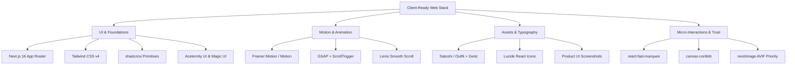

# From AI Prototype to Client-Ready Product: The Complete UI/UX & Frontend Transformation Guide

> **A definitive blueprint for engineering teams and product designers to take raw AI-generated web applications and elevate them into high-converting, polished, enterprise-grade digital platforms.**

---

## Table of Contents
1. [Executive Summary & The "AI-Generated Prototype" Problem](#1-executive-summary--the-ai-generated-prototype-problem)
2. [Core Skills & Technical Disciplines Applied](#2-core-skills--technical-disciplines-applied)
3. [Design Philosophy, Color Theory & Typographic Hierarchy](#3-design-philosophy-color-theory--typographic-hierarchy)
4. [Master Library & Resource Stack (2025–2026)](#4-master-library--resource-stack-20252026)
5. [The Step-by-Step UI/UX Transformation Blueprint](#5-the-step-by-step-uiux-transformation-blueprint)
6. [Real-World Case Studies & Architectural Solutions](#6-real-world-case-studies--architectural-solutions)
7. [The Key Prompts & Engineering Directives (Prompt Library)](#7-the-key-prompts--engineering-directives-prompt-library)
8. [Production Checklist for Client Readiness](#8-production-checklist-for-client-readiness)

---

## 1. Executive Summary & The "AI-Generated Prototype" Problem

When LLMs generate web interfaces from scratch, they often produce working code that suffers from telltale **"AI tells"**—visual and functional flaws that prevent the product from feeling client-ready:

| Typical AI-Generated Flaw | Why It Happens | Client-Ready Standard |
| :--- | :--- | :--- |
| **Generic Flat Aesthetics** | Default HTML tags or plain Tailwind colors (`bg-blue-500`, `#000000`). | Curated HSL tokens, deep layered charcoals (`#0A0A0F`), subtle multi-layered gradient meshes. |
| **Broken Mobile Viewports** | Desktop-first assumptions; multi-row filter wrapping; clipping tables. | Mobile-first architecture, swipeable horizontal pill rails, 44px thumb touch targets, zero overflow. |
| **iOS Auto-Zoom Disruption** | Small input fonts (`text-xs` = 12px) triggering auto-zoom on mobile Safari. | Universal 16px minimum on mobile inputs (`text-base sm:text-xs`) with responsive scaling. |
| **Hidden or Fragmented Login** | Navigation links hidden on small screens; confusing guest session states. | Universal guest-to-auth funnel: visible top headers, mobile drawers, and contextual upgrade banners. |
| **Static & Lifeless Interactions** | Abrupt renders without layout transitions, skeleton loading, or feedback. | Framer Motion layout animations, GSAP scroll triggers, Lenis inertia scrolling, micro-feedback. |
| **Placeholder / Fake Mockups** | Generic stock photos or lorem ipsum placeholders. | Live interactive sandboxes, authentic domain datasets, and real-time calculation engines. |

This guide documents the exact strategies, tools, and prompts used to transform **InternPrep AI** from a prototype into a production-grade placement intelligence platform.

---

## 2. Core Skills & Technical Disciplines Applied

### A. Design Systems Engineering
- **Atomic Token Architecture:** Built a unified design token foundation in `index.css` / Tailwind v4 containing CSS variables for `--background`, `--card`, `--primary`, `--muted`, and `--border`.
- **Elevation Hierarchy:** Created depth without harsh shadows using border lighting (`border-border/60`), subtle backdrop blur (`backdrop-blur-xl`), and dark mode surface elevation (`bg-card/80` over `bg-background`).

### B. Responsive & Mobile Viewport Engineering
- **Horizontal Swipe Rail Pattern:** Converted 5-row fragmented filter decks into touch-swipeable horizontal ribbons (`overflow-x-auto custom-scrollbar lg:flex-wrap`) on mobile devices.
- **Split-View Canvas Switching:** Provided dedicated mobile segmented controls (`Chat` | `Canvas` | `Doc`) for complex dual-column interview environments.
- **Adaptive Comparison Docks:** Built fixed floating trays with `min-w-0` truncation so multiple selected items never overflow narrow mobile screens.

### C. State Machine & Frictionless Onboarding UX
- **Hybrid Auth & Guest Sandbox Engine:** Powered by Zustand + localForage with Supabase OAuth. Enabled candidates to test rubrics, resumes, and interviews immediately in a guest sandbox with zero friction, while providing clear, non-intrusive upgrade touchpoints to sync data across devices.
- **Synchronized Filter Dependency Matrices:** Resolved multi-criteria filtering race conditions using memoized dependency arrays (`useMemo`) and multi-level data fallbacks.

### D. Production Hardening & Type Safety
- **Zero-Error Compilation:** Verified with `next build` (Turbopack) across all 19 App Router paths.
- **Device Emulation Auditing:** Validated rendering across mobile phone viewports (390×844, 360×800) and desktop resolutions (1920×1080) using headless browser subagents and DevTools emulation.

---

## 3. Design Philosophy, Color Theory & Typographic Hierarchy

### A. The Two Dominant 2026 Aesthetics

```
┌───────────────────────────────────────┬───────────────────────────────────────┐
│          TECHNO-FUTURIST              │               EDITORIAL               │
│  (Used for Developer Tools, AI SaaS)   │    (Used for Consumer SaaS, Media)    │
├───────────────────────────────────────┼───────────────────────────────────────┤
│ • Dark mode base (#0A0A0F, #0D0D12)   │ • Cream & Warm White backgrounds      │
│ • Neon Emerald / Cyan / Violet accents │ • Serif Display + Clean Sans body     │
│ • High-density Bento grids            │ • Generous editorial whitespace       │
│ • Monospace technical badges          │ • Magazine-style narrative layouts    │
└───────────────────────────────────────┴───────────────────────────────────────┘
```

### B. Dark Mode Principles (Eliminating the "Dull Black" Look)
1. **Never use pure black (`#000000`) for surfaces:** Pure black feels unnatural and causes eye strain. Use deep charcoal (`#09090B`, `#0A0A0F`, `#121216`).
2. **Layered Surface Elevation:**
   - Base Layer: `#09090B` (Canvas)
   - Secondary Layer: `#18181B` (Cards, Panels)
   - Tertiary Layer: `#27272A` (Hover states, active pills)
3. **Multi-Layered Gradient Mesh:** Use low-opacity radial gradients (`bg-gradient-to-r from-emerald-500/10 via-card to-blue-500/10`) to provide atmospheric depth without overpowering text.

### C. Typographic Pairing Rules
- **Heading Font:** High-personality geometric or variable sans-serif (e.g., **Satoshi**, **Outfit**, **Space Grotesk**).
- **Body & UI Font:** Ultra-legible workhorse font (e.g., **Geist Sans**, **Inter**, **Plus Jakarta Sans**).
- **Technical Badges:** Clean monospace (e.g., **Geist Mono**, **JetBrains Mono**) for badges like `[DAY 1 PLACEMENT]`, `[PHASE 1]`, and status indicators.
- **Rule of Thumb:** Never use more than 2 font families (plus 1 optional monospace).

---

## 4. Master Library & Resource Stack (2025–2026)

Referenced from our project master compilation ([premium_landing_page_resources.md](file:///c:/Interview%20Preparation%20Platform/premium_landing_page_resources.md)):



### Resource Matrix

| Category | Recommended Tool / Library | Role in Production | Why Choose It |
| :--- | :--- | :--- | :--- |
| **Core Components** | **[shadcn/ui](https://ui.shadcn.com)** | Base component library | Fully accessible, zero vendor lock-in, customizable Tailwind code. |
| **Hero & 3D Effects** | **[Aceternity UI](https://ui.aceternity.com)** | High-impact visual components | Spotlight effects, 3D card tilt, animated text reveal, glowing borders. |
| **Micro-Animations** | **[Magic UI](https://magicui.design)** | Marketing interaction blocks | Bento grids, number tickers, shimmer buttons, animated marquees. |
| **Component Layouts** | **[Shadcnblocks](https://shadcnblocks.com)** | Full marketing page sections | High-converting pricing tables, testimonial grids, hero layouts. |
| **Animation Engine** | **[Motion (Framer Motion)](https://motion.dev)** | Declarative UI animation | Animate presence, spring physics, layout transitions, exit effects. |
| **Scroll Storytelling** | **[GSAP + ScrollTrigger](https://gsap.com)** | Scroll-driven sequences | Timeline choreography, sticky pin sections. 100% free commercial license. |
| **Smooth Scrolling** | **[Lenis](https://lenis.studiofreight.com)** | Inertia-based smooth scroll | Cinematic scrolling that makes the entire platform feel luxurious. |
| **Logo Marquee** | **[react-fast-marquee](https://react-fast-marquee.com)** | Partner & recruiter ticker | Lightweight, zero-lag continuous CSS marquee. |
| **Celebration Effects**| **[canvas-confetti](https://github.com/catdad/canvas-confetti)** | Success & milestone confetti | 6kB lightweight confetti engine for milestone celebrations. |
| **Color & Mesh** | **[Coolors](https://coolors.co) / [Mesher](https://csshero.org/mesher/)** | Palette & gradient generators | WCAG contrast audits and pure CSS mesh gradient outputs. |
| **Inspiration Galleries**| **[Godly](https://godly.website) / [Landingfolio](https://landingfolio.com)** | Design benchmark galleries | Curated examples of world-class SaaS animations and user flows. |

---

## 5. The Step-by-Step UI/UX Transformation Blueprint

```
Phase 1: Audit & Anti-Pattern Discovery
  └── Scan for "AI tells": font size bugs, viewport overflow, hidden buttons, dead ends.

Phase 2: Establish Design Tokens & Visual Hierarchy
  └── Set semantic color variables, elevated dark mode surfaces, and consistent typography.

Phase 3: Architect the Frictionless Auth Funnel
  └── Implement Guest Sandbox mode, visible mobile header actions, and contextual upgrade cards.

Phase 4: Responsive Mobile Layout Overhaul
  └── Deploy horizontal swipe rails for filters, 16px inputs against iOS zoom, and 44px touch targets.

Phase 5: High-Density Data & Split-Screen UX
  └── Implement responsive cards, table horizontal scroll hints, and mobile canvas toggles.

Phase 6: Motion Polish, Micro-Feedback & Verification
  └── Add Framer Motion transitions, zero-error production build (`npm run build`), and device testing.
```

---

## 6. Real-World Case Studies & Architectural Solutions

### Case 1: The Hidden Login & Mobile Navigation Mystery
- **Problem:** On mobile phones, guest users had no way to log in. In `LandingNavbar.tsx`, the "Sign In" button had `hidden sm:inline-flex`. On the Dashboard, the mobile header omitted sign-in actions, and the mobile drawer had no user footer.
- **Solution:**
  1. Updated the mobile top bar to always show a compact `Sign In` button and `Sandbox` CTA alongside the Hamburger menu.
  2. Built a **Candidate Workspace** user card inside the mobile drawer with instant "Log In" and "Sandbox →" options.
  3. Added an **"EXPLORING IN GUEST SANDBOX"** callout banner on the dashboard with a direct `Sign In / Register` CTA.

### Case 2: iOS Safari Auto-Zoom Viewport Distortion
- **Problem:** Tapping into input fields on mobile Safari caused the screen to aggressively zoom in, displacing navigation buttons and breaking responsive layouts.
- **Root Cause:** iOS Safari automatically zooms any input with `font-size < 16px` (e.g., `text-xs` = 12px or `text-sm` = 14px).
- **Solution:** Applied responsive typography: `text-base sm:text-xs` with `h-10 sm:h-9`. On mobile phones, inputs render at 16px (stopping auto-zoom completely) while maintaining compact 12px styling on desktop screens.

### Case 3: 5-Row Filter Deck Fragmentation on Mobile
- **Problem:** The Placement Analysis toolbar (Year, Phase, Tier, Day Slots, International, Sort, ViewMode) wrapped across 5 fragmented rows, pushing company results completely off-screen.
- **Solution:** Wrapped the filter deck in a swipeable horizontal rail:
  ```tsx
  <div className="flex items-center gap-2.5 overflow-x-auto pb-1 max-w-full custom-scrollbar lg:flex-wrap lg:overflow-x-visible lg:justify-end shrink-0">
  ```
  Mobile candidates can effortlessly swipe through sessions and tiers with their thumb, while desktop users retain a clean wrapped layout.

---

## 7. The Key Prompts & Engineering Directives (Prompt Library)

Use these battle-tested prompts when directing AI agents or engineers to transform web interfaces:

### Prompt 1: The "Eliminate AI Look" Aesthetic Overhaul
```text
Role: Senior Staff Frontend Architect & Design Systems Lead.
Task: Redesign this web application to eliminate generic "AI-generated" looks and elevate it to a premium, client-ready product (benchmarks: Linear.app, Vercel, Ramp).

Directives:
1. Palette: Eliminate harsh pure black (#000000) and plain primary colors. Implement an elevated dark mode using deep charcoals (#0A0A0F, #121216), subtle alpha borders (border-border/60), and multi-layered gradient meshes (from-emerald-500/10 via-card to-blue-500/10).
2. Typography: Use a high-contrast pairing (e.g., Satoshi/Outfit for headers, Geist/Inter for UI, and a dedicated Monospace for technical status badges).
3. Depth & Surfaces: Use backdrop-blur-xl and card elevation layers rather than flat backgrounds. Add subtle micro-animations using Framer Motion for enter/exit states.
4. Deliverable: Update the global CSS tokens and refactor the component layout without breaking any existing business logic.
```

### Prompt 2: Mobile-First Responsive & Touch Optimization
```text
Task: Audit and fix all mobile viewport (< 640px) flaws across our platform.

Requirements:
1. Prevent iOS Auto-Zoom: Ensure all form inputs, textareas, and selects have a minimum font size of 16px on mobile (text-base sm:text-xs) with touch-friendly heights (h-10 sm:h-9).
2. Thumb Touch Targets: All interactive buttons, switches, and menu toggles must meet the 44px x 44px minimum touch target standard.
3. Multi-Row Filter Wrapping: Convert any fragmented multi-row filter decks into touch-swipeable horizontal ribbons (overflow-x-auto custom-scrollbar lg:flex-wrap).
4. Overflow Protection: Ensure floating trays, comparison docks, and badges use `min-w-0` and `truncate` to prevent horizontal screen overflow.
5. Provide a swipe hint for wide table views and test across 360px and 390px mobile viewports.
```

### Prompt 3: Frictionless Guest-to-Auth Funnel Architecture
```text
Task: Architect a seamless guest sandbox mode that maximizes onboarding while providing high-visibility upgrade pathways.

Requirements:
1. Guest Continuity: Free/guest users must be able to explore the sandbox immediately without mandatory upfront signup.
2. Mobile & Desktop Navigation:
   - Keep a prominent "Sign In" button visible in the top header on both mobile (< 640px) and desktop.
   - In the mobile hamburger drawer, render a dedicated user state card at the top ("Candidate Workspace: Sign in to save sessions").
   - In the sidebar footer, replace generic "Guest" text with an actionable "Sign In to Sync" card.
3. Contextual Value Banner: Add an elegant, non-intrusive alert banner on the dashboard explaining: "Exploring in Guest Sandbox. Sign in to permanently save your progress across devices."
4. Escape Hatch on Login: Add a "Skip for now • Continue as Guest →" link on /login for users who arrived there by mistake.
```

### Prompt 4: High-Density Data & Split-Screen Mobile UX
```text
Task: Optimize our dual-column simulator/dashboard for mobile screens.

Requirements:
1. Split-View Controller: Replace the side-by-side split pane on mobile with a compact segmented switcher (e.g., [Chat | Canvas | Document]).
2. Progress Indicator: Add a compact mobile phase badge (e.g., "P2: Framework Structuring") visible on small headers where full desktop progress pills are hidden.
3. Keyboard Protection: Ensure chat inputs and voice toggles remain pinned and accessible above mobile virtual keyboards.
```

---

## 8. Production Checklist for Client Readiness

Before handing over any AI-assisted project to a client or stakeholder, verify against this 10-point checklist:

- [x] **1. Typography Scaled for iOS:** All inputs use $\ge 16\text{px}$ on mobile (`text-base sm:text-xs`) to prevent Safari zoom distortion.
- [x] **2. Touch Target Compliance:** All buttons and interactive icons have $\ge 40\text{--}44\text{px}$ hit areas.
- [x] **3. Frictionless Authentication:** "Sign In" is visible on mobile top bars, drawer menus, and dashboard guest banners.
- [x] **4. Zero Viewport Clipping:** Multi-filter rows scroll horizontally; floating docks use `truncate` and `min-w-0`.
- [x] **5. Rich Aesthetic Elevation:** Surfaces use deep charcoals, subtle borders, and layered mesh gradients rather than flat colors.
- [x] **6. Motion & Micro-Interactions:** Buttons provide loading/success feedback; cards have hover elevation; page transitions are smooth.
- [x] **7. Authentic Social Proof:** Logo marquees (`react-fast-marquee`) and verified metric badges replace generic placeholders.
- [x] **8. Table Mobile Usability:** Wide data tables have horizontal touch-scroll with an explicit visual swipe hint.
- [x] **9. Clean TypeScript & Build:** `npm run build` passes with 0 type errors, 0 lint warnings, and optimal route bundling.
- [x] **10. Cross-Device Verification:** Validated on both mobile phone viewports (390×844) and high-DPI desktop viewports.

---

*Authored by Antigravity IDE • InternPrep AI Engineering Documentation*
