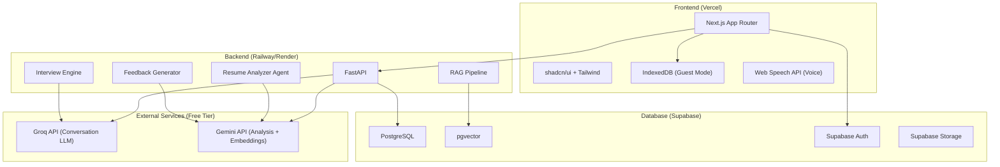
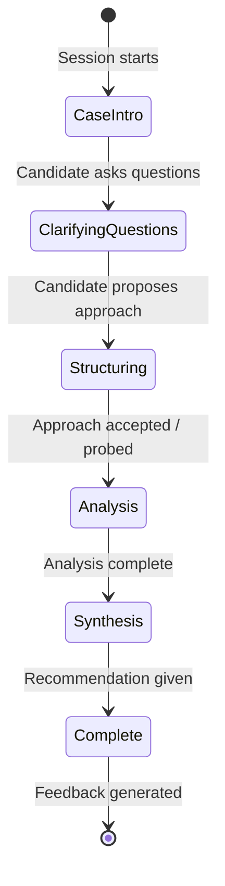
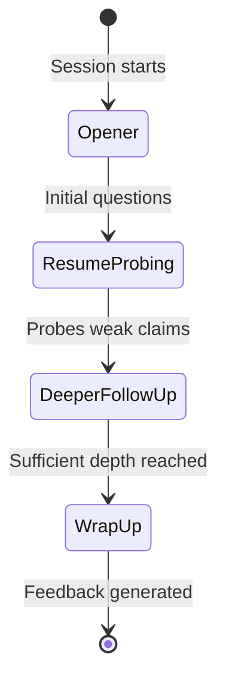

# AI Interview Coach — IITB Internship Prep Platform

> Consolidated implementation plan synthesized from three independent LLM plans, with all design decisions confirmed by the project owner.

---

## 1. Vision & Product Strategy

### Core Belief *(from LLM 1)*
Students don't fail interviews because they lack intelligence. They fail because they prepare the wrong topics, discover important information too late, cannot practice realistically, and receive generic feedback. This platform eliminates those failures.

### North Star *(from LLM 2)*
A junior finishes two weeks of using this and lands their target internship, then says *"this was actually useful."*

### Product Moat *(from LLM 1)*
The competitive advantage is **not** the LLM. It's the combination of:
1. IITB-specific internship knowledge (curated from real experiences)
2. Company-specific preparation intelligence
3. Resume-aware AI that probes your actual claims
4. Progressive case interview simulation (not the "dump everything upfront" approach)
5. Knowledge that compounds every year via community contributions (V2)

### What This Is NOT
- Not a generic "practice any interview" tool — depth on a narrow scope beats breadth
- Not a hire/no-hire verdict machine — feedback is dimensional and constructive
- Not a ChatGPT wrapper — the knowledge base is the differentiator, the AI orchestrates it

---

## 2. Target Audience & Scope

| Dimension | V1 Decision |
|---|---|
| **Audience** | IIT Bombay second-year students (internship season) |
| **Interview Types** | Case interviews (primary focus) + HR + Resume-based + Brainstormer + Finance/PM/AI-DS modes |
| **Excluded** | Core engineering roles, software engineering interviews |
| **Companies** | Seed list to be provided by owner (company-specific intelligence per company) |
| **Expansion Path** | V2: IIT placements → V3: Multi-college → V4: General career prep |

---

## 3. V1 Feature Set

### Build (In Scope)

| # | Feature | Description | Source |
|---|---|---|---|
| 1 | **Guest Mode + Optional Auth** | Zero-friction guest mode via IndexedDB; optional Supabase signup for cross-device sync | LLM 3 |
| 2 | **Resume Upload & Intelligence** | Drag-and-drop PDF upload → AI analysis that flags vague claims, generates likely questions per bullet, maps bullets to target company/role. Runs once at upload, stored as structured JSON. | LLM 1 + 2 |
| 3 | **Resume Heatmap** | Visual map of every resume bullet showing risk level, likely questions, and follow-up depth | LLM 1 |
| 4 | **Company Intelligence Hub** | Company profiles with round structure, difficulty, values, past question themes, and a prioritized study plan auto-generated when a student selects a company | LLM 1 + 2 |
| 5 | **Resume + Company Fusion** | AI identifies which resume bullets matter most for the selected company and prioritizes probing on those | LLM 1 |
| 6 | **AI Interview Studio** | Text-based mock interview with human-like pacing (simulated typing pauses), cross-questioning, and dynamic follow-ups | All 3 |
| 7 | **Case Interview State Machine** | For case interviews: 5-phase state machine (intro → clarifying → structuring → analysis → synthesis) with progressive data reveal, hidden answer key, and MECE probing | LLM 2 |
| 8 | **Consulting Scratchpad** | Split-screen mode: chat on one side, MECE frameworks/calculations on the other. AI monitors both inputs. Time pressure simulation. | LLM 3 |
| 9 | **HR/Resume Interview Mode** | Simpler prompt-based flow (not state machine) for HR, resume-based, and brainstormer questions. Cross-questions resume claims, probes for specifics. | LLM 2 + 3 |
| 10 | **Rubric-Based Feedback** | End-of-session structured feedback across 7 fixed dimensions. No numeric score, no hire/no-hire. 2-3 concrete "fix this next" action items. | LLM 2 |
| 11 | **Interview Timeline Replay** | Post-interview timeline showing where answers became stronger or weaker, with moment-by-moment analysis | LLM 1 |
| 12 | **RAG Knowledge Base** | pgvector-backed retrieval with metadata-filtered search (company, round_type, difficulty). Never blind semantic search. | LLM 2 |
| 13 | **Browser-Native Voice** | Optional voice mode using Web Speech API (free, Chrome-compatible). Text remains the primary interface. | User decision |
| 14 | **Personal Weakness Detection** | Across multiple sessions, AI identifies recurring weaknesses and surfaces them | LLM 1 |
| 15 | **Dashboard** | Central hub showing resume status, selected companies, session history, weak areas, and "what to do next" recommendations | LLM 1 |

### Explicitly Deferred (V2+)

| Feature | Rationale |
|---|---|
| Community / senior contributions | Focus V1 on core prep; add network effects in V2 |
| Analytics dashboard | Not needed for V1 utility |
| Preparation roadmap / daily tasks | Nice-to-have, not essential |
| Gamification (streaks, XP, leaderboards) | Subtle readiness % is enough for V1 |
| Multi-agent panel interviews | Complexity not justified in V1 |
| Mobile app | Web-first, responsive design covers mobile |
| Mentor marketplace | V3+ feature |
| Coding round support | Out of scope (non-core focus) |

---

## 4. Feedback Rubric *(from LLM 2 — fixed dimensions)*

> [!IMPORTANT]
> No overall numeric score. No hire/no-hire label. Feedback is dimensional, qualitative, and actionable.

| # | Dimension | Applies To |
|---|---|---|
| 1 | Structuring & MECE-ness | Case interviews |
| 2 | Business Intuition | Case + PM interviews |
| 3 | Quantitative Reasoning | Case + Finance interviews |
| 4 | Communication Clarity | All types |
| 5 | Depth vs. Recitation | All types |
| 6 | Resume Grounding | Resume-based questions |
| 7 | Handling Follow-ups & Pressure | All types |

**Output format:** Qualitative per-dimension notes + 2-3 concrete "fix this next" action items + suggested resources.

---

## 5. AI Mentor Personality *(from LLM 1)*

The AI should feel like an experienced IITB senior:
- **Honest** — won't sugarcoat weak answers
- **Encouraging** — constructive, not discouraging
- **Concise** — gets to the point
- **Evidence-driven** — every recommendation includes a rationale

**Never:** overly motivational, robotic, vague, unnecessarily verbose.

---

## 6. Technical Architecture

### Locked Decisions

| Layer | Technology | Rationale |
|---|---|---|
| **Frontend** | Next.js (App Router) + TypeScript + Tailwind CSS + shadcn/ui | Polished UI, rapid development, free Vercel hosting |
| **Backend** | FastAPI + Pydantic + SQLAlchemy + Alembic | Scalable for AI/ML workloads, better async support for LLM calls |
| **Database** | Supabase PostgreSQL + pgvector + Supabase Auth + Supabase Storage | One free-tier system covers auth, relational data, vector search, file storage |
| **Conversational LLM** | Groq API — Llama 3.3 70B (`llama-3.3-70b-versatile`) | Low-latency real-time conversation on free tier |
| **Analysis/Feedback LLM** | Google Gemini API — `gemini-2.5-flash` | Fewer, heavier calls (resume analysis, rubric scoring) |
| **Embeddings** | Gemini embeddings (`gemini-embedding-001`) → stored in pgvector | Free tier, consistent with Gemini analysis stack |
| **Resume Parsing** | pdf-parse / pdfjs (self-hosted) | No external API cost |
| **Voice (optional)** | Browser-native Web Speech API | Free, works in Chrome, zero API cost |
| **Frontend Hosting** | Vercel (free tier) | Next.js native platform |
| **Backend Hosting** | Railway or Render (free tier) | FastAPI deployment |
| **State Management** | Zustand (frontend) + IndexedDB via localforage (guest mode) | Lightweight, supports offline-first guest experience |

### Architecture Diagram



### Repository Structure (Monorepo)

```
ai-interview-coach/
├── apps/
│   ├── web/                    # Next.js frontend
│   │   ├── app/                # App Router pages
│   │   ├── components/         # UI components
│   │   ├── lib/                # Client utilities
│   │   └── stores/             # Zustand stores
│   └── api/                    # FastAPI backend
│       ├── routers/            # API route modules
│       │   ├── auth.py
│       │   ├── resume.py
│       │   ├── company.py
│       │   ├── interview.py
│       │   ├── feedback.py
│       │   └── knowledge.py
│       ├── services/           # Business logic
│       │   ├── rag.py
│       │   ├── llm.py
│       │   ├── embeddings.py
│       │   ├── parsing.py
│       │   └── scoring.py
│       ├── agents/             # AI agent modules
│       │   ├── resume_analyzer.py
│       │   ├── case_interviewer.py
│       │   ├── hr_interviewer.py
│       │   └── feedback_generator.py
│       ├── prompts/            # Prompt templates (isolated, versioned)
│       │   ├── resume.md
│       │   ├── case_interview.md
│       │   ├── hr_interview.md
│       │   ├── feedback.md
│       │   └── system.md
│       ├── models/             # Pydantic models
│       └── config.py
├── packages/
│   └── shared/                 # Shared types & utilities
├── data/
│   └── companies/              # Company intelligence markdown (seed data)
├── scripts/                    # Data ingestion, KB setup scripts
├── docs/                       # Documentation
└── .env.example
```

### Frontend Routes

| Route | Purpose |
|---|---|
| `/` | Landing page (guest entry + login) |
| `/dashboard` | Central hub: resume status, companies, sessions, weak areas |
| `/resume` | Resume upload, analysis, heatmap |
| `/company/[slug]` | Company-specific preparation plan |
| `/interview` | Interview session (chat + optional scratchpad) |
| `/interview/[id]/feedback` | Post-session feedback report & timeline |
| `/knowledge` | Searchable knowledge base |
| `/profile` | User profile & settings |

---

## 7. Database Schema

> [!NOTE]
> Based on LLM 2's schema (the most detailed), extended with fields from LLM 1's design.

```sql
-- Enable pgvector
CREATE EXTENSION IF NOT EXISTS vector;

-- User profiles (linked to Supabase Auth)
CREATE TABLE profiles (
  id UUID REFERENCES auth.users PRIMARY KEY,
  target_companies TEXT[],
  weak_areas TEXT[],
  preferred_interview_types TEXT[],
  created_at TIMESTAMPTZ DEFAULT now()
);

-- Resumes with structured analysis
CREATE TABLE resumes (
  id UUID PRIMARY KEY DEFAULT gen_random_uuid(),
  user_id UUID REFERENCES profiles(id) ON DELETE CASCADE,
  raw_text TEXT,
  file_url TEXT,                  -- Supabase Storage path
  analysis JSONB,                 -- bullets, flagged claims, predicted questions
  created_at TIMESTAMPTZ DEFAULT now()
);

-- Company intelligence
CREATE TABLE companies (
  id UUID PRIMARY KEY DEFAULT gen_random_uuid(),
  name TEXT UNIQUE NOT NULL,
  slug TEXT UNIQUE NOT NULL,
  category TEXT,                  -- consulting / finance / product / supply_chain / ai_ds
  process_rounds JSONB,           -- round-by-round process info
  difficulty TEXT,
  values TEXT,
  notes TEXT,
  last_updated TIMESTAMPTZ DEFAULT now()
);

-- RAG knowledge base chunks (metadata-filtered retrieval)
CREATE TABLE kb_chunks (
  id UUID PRIMARY KEY DEFAULT gen_random_uuid(),
  content TEXT NOT NULL,
  embedding VECTOR(768),
  company_id UUID REFERENCES companies(id) ON DELETE SET NULL,
  round_type TEXT,                -- case / hr / resume / brainstormer
  interview_type TEXT,
  difficulty TEXT,
  source TEXT,
  tags TEXT[],
  created_at TIMESTAMPTZ DEFAULT now()
);

CREATE INDEX ON kb_chunks USING ivfflat (embedding vector_cosine_ops) WITH (lists = 100);

-- Interview sessions with state tracking
CREATE TABLE interview_sessions (
  id UUID PRIMARY KEY DEFAULT gen_random_uuid(),
  user_id UUID REFERENCES profiles(id) ON DELETE CASCADE,
  company_id UUID REFERENCES companies(id),
  interview_type TEXT,            -- case / hr / resume / brainstormer
  status TEXT DEFAULT 'in_progress',
  case_state JSONB,               -- phase tracking, revealed data, answer key (never sent to frontend)
  scratchpad_content TEXT,        -- consulting scratchpad state
  created_at TIMESTAMPTZ DEFAULT now(),
  completed_at TIMESTAMPTZ
);

-- Session messages (conversation transcript)
CREATE TABLE session_messages (
  id UUID PRIMARY KEY DEFAULT gen_random_uuid(),
  session_id UUID REFERENCES interview_sessions(id) ON DELETE CASCADE,
  role TEXT NOT NULL,              -- interviewer / candidate
  content TEXT NOT NULL,
  phase TEXT,                     -- which interview phase this message belongs to
  created_at TIMESTAMPTZ DEFAULT now()
);

-- Feedback per completed session
CREATE TABLE session_feedback (
  id UUID PRIMARY KEY DEFAULT gen_random_uuid(),
  session_id UUID REFERENCES interview_sessions(id) ON DELETE CASCADE,
  dimension_notes JSONB,          -- per-dimension qualitative notes (7 dimensions)
  fix_next TEXT[],                -- 2-3 concrete action items
  timeline_data JSONB,            -- moment-by-moment strength/weakness analysis
  suggested_resources JSONB,
  created_at TIMESTAMPTZ DEFAULT now()
);

-- Row Level Security
ALTER TABLE profiles ENABLE ROW LEVEL SECURITY;
ALTER TABLE resumes ENABLE ROW LEVEL SECURITY;
ALTER TABLE interview_sessions ENABLE ROW LEVEL SECURITY;
ALTER TABLE session_messages ENABLE ROW LEVEL SECURITY;
ALTER TABLE session_feedback ENABLE ROW LEVEL SECURITY;

CREATE POLICY "own profile" ON profiles FOR ALL USING (auth.uid() = id);
CREATE POLICY "own resumes" ON resumes FOR ALL USING (auth.uid() = user_id);
CREATE POLICY "own sessions" ON interview_sessions FOR ALL USING (auth.uid() = user_id);
CREATE POLICY "own messages" ON session_messages FOR ALL USING (
  EXISTS (SELECT 1 FROM interview_sessions s WHERE s.id = session_id AND s.user_id = auth.uid())
);
CREATE POLICY "own feedback" ON session_feedback FOR ALL USING (
  EXISTS (SELECT 1 FROM interview_sessions s WHERE s.id = session_id AND s.user_id = auth.uid())
);
```

---

## 8. AI Interview Engine Design

### Case Interview: State Machine *(from LLM 2)*



**Key rules:**
- AI holds a hidden "case answer key" (key data points, expected structure, expected insight)
- Data is revealed **only** in response to relevant candidate questions (progressive disclosure)
- The `case_state` JSONB column tracks: current phase, what has been revealed, what remains hidden
- Conversation history provides tone/context continuity; `case_state` is the source of truth for what's been revealed
- Scratchpad content is injected into the LLM context alongside chat history

### HR / Resume / Brainstormer: Prompt-Based *(simpler flow)*



- Uses the stored resume analysis (flagged bullets, predicted questions) rather than re-analyzing per turn
- Cross-questions resume claims: if a bullet claims impact, probes for numbers, decisions, and individual contribution vs team

### RAG Pipeline *(from LLM 2 + 1)*

```
User Query → Metadata Filter (company, round_type, difficulty) → Vector Similarity Search (filtered set) → Re-rank → Inject into LLM Context → Generate Response
```

> [!WARNING]
> Never do a raw similarity search across the entire knowledge base. Always filter by metadata tags first, then do semantic search within the filtered set. Blind search will surface irrelevant company/interview-type content.

---

## 9. Environment Variables

```env
# Supabase
NEXT_PUBLIC_SUPABASE_URL=
NEXT_PUBLIC_SUPABASE_ANON_KEY=
SUPABASE_SERVICE_ROLE_KEY=

# Groq (free tier — console.groq.com)
GROQ_API_KEY=

# Gemini (free tier — aistudio.google.com)
GEMINI_API_KEY=

# Model configuration
CONVERSATION_MODEL=llama-3.3-70b-versatile
ANALYSIS_MODEL=gemini-2.5-flash
EMBEDDING_MODEL=gemini-embedding-001
```

---

## 10. Two-Week Sprint Plan

### Phase 1: Foundation & Infrastructure (Days 1-2)

| Task | Details |
|---|---|
| Monorepo setup | Initialize workspace with Next.js app + FastAPI backend |
| Supabase setup | Database, Auth, Storage, pgvector extension |
| Schema migration | Apply database schema via Alembic |
| Auth flow | Supabase Auth (email + Google) + guest mode with IndexedDB |
| CI/CD | GitHub Actions for lint/test; Vercel preview deploys |
| Environment config | `.env.example`, config modules for both frontend and backend |
| Landing page | Minimalist homepage with Guest / Login options |

**Acceptance:** User can sign in (or enter as guest). Frontend communicates with backend. Deploy preview available.

---

### Phase 2: Resume Intelligence (Days 3-4)

| Task | Details |
|---|---|
| PDF upload | Drag-and-drop zone, Supabase Storage for authenticated users, local for guests |
| Resume parsing | pdf-parse/pdfjs text extraction, tuned for IITB resume format |
| AI analysis | Single Gemini API call: extract bullets, flag vague/inflated claims, generate likely questions per bullet |
| Resume heatmap | Visual UI showing risk level, likely questions, follow-ups per bullet |
| Storage | Store analysis as structured JSON on the `resumes` row |

**Acceptance:** Uploading any resume generates structured insights with a visual heatmap.

---

### Phase 3: Knowledge Layer & RAG (Days 5-6)

| Task | Details |
|---|---|
| Data collection | Owner provides IITB interview experiences, question banks, company data |
| Content structuring | Process raw content into tagged markdown chunks |
| Company model | Seed company table with process rounds, difficulty, values |
| Embedding pipeline | Gemini embeddings → pgvector storage with metadata tags |
| RAG retrieval | Metadata-filtered vector search + re-ranking |
| Company Hub UI | Company profile pages with auto-generated preparation plans |
| Resume + Company Fusion | AI identifies most relevant resume bullets for selected company |

**Acceptance:** Selecting a company generates a curated preparation plan; search retrieves relevant content filtered by company/type.

---

### Phase 4: Interview Engine (Days 7-9)

| Task | Details |
|---|---|
| Session management | Create/resume/complete sessions with state tracking |
| Case state machine | 5-phase engine with progressive data reveal, hidden answer key |
| Chat interface | Real-time text chat with simulated typing pauses |
| Consulting scratchpad | Split-screen: chat + MECE framework/calculation pad; AI monitors both |
| HR/Resume mode | Prompt-based interview flow with resume-aware cross-questioning |
| Brainstormer mode | Open-ended question mode with follow-up probing |
| Voice input (optional) | Web Speech API integration for speech-to-text input |
| Transcript storage | All messages stored with phase metadata |

**Acceptance:** Complete a full case interview with progressive reveal, scratchpad, and dynamic follow-ups without errors.

---

### Phase 5: Feedback & Insights (Days 10-11)

| Task | Details |
|---|---|
| Feedback generation | End-of-session Gemini API call with full transcript + rubric |
| 7-dimension rubric | Per-dimension qualitative notes (structuring, business intuition, quant reasoning, communication, depth, resume grounding, pressure handling) |
| Action items | 2-3 concrete "fix this next" points per session |
| Timeline replay | Visual timeline showing strength/weakness progression through the interview |
| Suggested resources | RAG-powered resource recommendations based on weak dimensions |
| Weakness tracking | Cross-session weakness pattern detection |
| Dashboard | Central hub: resume status, companies, session history, weak areas, "what to do next" |

**Acceptance:** Every completed interview produces a useful, dimensional feedback report with timeline and actionable next steps.

---

### Phase 6: Polish & Deploy (Days 12-14)

| Task | Details |
|---|---|
| Responsive design | Full mobile/tablet responsiveness |
| Error handling | Graceful degradation for rate limits, timeouts, API failures |
| Loading states | Skeleton screens, progress indicators throughout |
| Guest ↔ Auth sync | IndexedDB data migration to Supabase on signup |
| User testing | Test with 2-3 actual IITB juniors, fix what breaks |
| Deploy | Vercel (frontend) + Railway/Render (backend) + Supabase (DB) |
| Documentation | README, setup guide, deployment docs |

**Acceptance:** End-to-end flow works in production: sign up (or guest) → upload resume → select company → complete interview → receive feedback.

---

## 11. Hard Constraints *(from LLM 2 — non-negotiable)*

1. **Zero budget.** Every external service must have a genuinely free tier at project scale.
2. **No hire/no-hire verdicts.** Feedback is dimensional and constructive.
3. **Progressive case disclosure is non-negotiable.** The AI interviewer must never dump the full case prompt with all data upfront. Data is revealed only in response to relevant candidate questions.
4. **Minimal data storage.** Store only what's necessary — no speculative fields.
5. **Prompts live in dedicated files** (`prompts/`), not inlined in route handlers.
6. **Every LLM call has a fallback/error path** — free tiers will get rate limited.
7. **AI providers must be interchangeable** — abstract behind interfaces.

---

## 12. Error & Cost Strategy

### Error Handling *(from LLM 1)*
- **Retry:** Transient LLM errors (rate limits, timeouts)
- **Fallback:** Secondary provider if primary fails (Groq ↔ Gemini)
- **Graceful degradation:** Search without AI, cached responses, offline guest mode

### Cost Optimization *(from LLM 1)*
- Cache embeddings (don't re-embed unchanged content)
- Cache retrieval results for repeated queries
- Summarize long context before sending to LLM
- Model routing: use cheaper model for simple tasks, heavier model for analysis
- Async ingestion for knowledge base updates

---

## 13. Coding Standards

| Area | Standard |
|---|---|
| TypeScript | Strict mode on |
| Python | Black + Ruff |
| Components | Small, reusable, composition over inheritance |
| Business logic | Never in route handlers — always in services |
| AI providers | Behind abstract interfaces (swappable) |
| Prompts | Versioned, isolated in `prompts/`, testable |
| Commits | Small, meaningful messages, one module at a time |

---

## 14. Testing Strategy

| Layer | Tool | Coverage |
|---|---|---|
| Frontend E2E | Playwright | Auth, resume upload, interview flow, feedback |
| Backend Unit | Pytest | API routes, services, agents |
| AI Quality | Custom | Prompt regression tests, golden answer evaluation, retrieval quality tests |

---

## 15. Post-V1 Roadmap

| Priority | Feature |
|---|---|
| **P1 (V1.5)** | Community (senior experience uploads), better RAG, more companies |
| **P2 (V2)** | Personalization, progress tracking over time, preparation roadmap |
| **P3 (V3)** | Multi-college support, placement season support |
| **P4 (V4)** | General career prep, multi-agent panel interviews |

---

## 16. Product Decision Framework *(from LLM 1)*

Before adding any feature, ask:
1. Does it improve interview outcomes?
2. Is it difficult to achieve with generic ChatGPT?
3. Does it leverage institute-specific knowledge?
4. Will students use it under time pressure?
5. Can it be maintained sustainably?

**If fewer than 3 answers are "yes", don't build it.**

---

## User Review Required

> [!IMPORTANT]
> **Company Seed List:** You mentioned you'll provide the specific list of companies. This is needed before Phase 3 (Days 5-6) begins. Please prepare the list with: company name, category (consulting/finance/PM/etc.), and any process/round details you have.

> [!IMPORTANT]
> **Knowledge Base Content:** You confirmed you have access to past question banks and senior docs. Please begin organizing this material by company and interview type so it's ready for ingestion in Phase 3.

> [!IMPORTANT]
> **Voice Scope:** You indicated voice is important. The plan includes browser-native Web Speech API (free, Chrome-compatible) as an optional speech-to-text input mode in V1. This means students can *speak* their answers (converted to text) rather than typing. Full voice *output* (AI speaking back) would require paid APIs and is deferred. Is speech-to-text input sufficient for V1?

## Open Questions

> [!NOTE]
> **Product Name:** All three plans leave the product name undecided. Do you have a name in mind, or should we brainstorm options?

> [!NOTE]
> **Branding:** Colors, logo, visual identity — should we define these before Phase 1, or iterate during development?

---

## Verification Plan

### Automated Tests
- `pytest` for all FastAPI routes and services
- Playwright E2E for critical user flows (auth → resume → interview → feedback)
- Prompt regression tests comparing outputs against golden answers

### Manual Verification
- Test with 2-3 actual IITB second-year students during Phase 6
- Verify progressive case reveal works realistically
- Confirm scratchpad + chat dual-input functions correctly
- Verify guest mode → signup data migration
- Test rate limit handling on Groq and Gemini free tiers
- Responsive design testing on mobile and tablet
